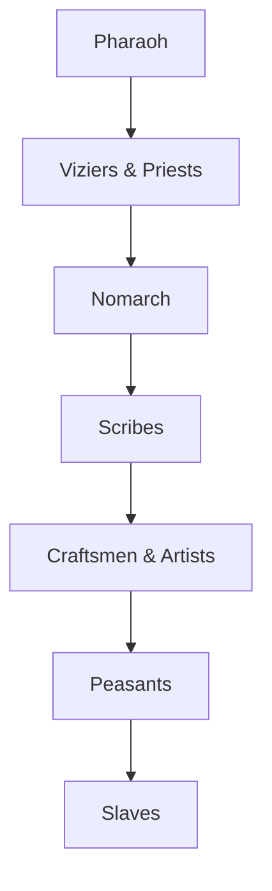

- Wine, Wood, Incense trade routes
- Dynasties
- United Kingdom
- Scribes were analogous to bureaucrats
- Largely desert aside from land along the rivers
- 10,000 people is a huge city
![[Pasted image 20211102024727.png]]

![[Pasted image 20211102122729.png]]

deity|domain|real-world analogue
---|---|-
Ityn|sun|Aten/Aton and Ra

# Epthyro
Epthyro is a bronze-age, desert civilization founded on the banks of the miraculous Tansic river, based on real-world ancient Egypt. 

## The Big Picture
***The Epthyrean Pantheon.*** The Epthyrean people have their own pantheon of deities based on the ancient Egyptian pantheon.

***Untamed Ecology.*** The world is uncharted and the surrounding desert landscape is rife with powerful monsters that make it uninhabitable for normal people. As one travels away from the Tansic, the world becomes much more dangerous and mysterious.

***New World.*** While Epthyrean civilization has its own lengthy history, much of the world is still new. Dungeons and ancient pyramids are more present-time features rather than relics lost to time.

***Conflict.*** The politic of Epthyrean civilization is rife with conflict, with powerful individuals that have their own agendas.

***Magic is Rare.*** Wizardry is analogous to bureaucracy and aristocracy, and only few have mastered the art. Even rarer are those that are born with innate magical prowess. The most common forms of magic are those that pertain to a holy or unholy nature, namely clerics and druids. Artifice is not a practiced art yet, but magic items are frequently manifested in times of great emotion and turmoil.

## Political Structure
Epthyro is vast and is coveted by many powerful individuals. At the height of political power are the Nomarchs who currently vie for the seat of the pharaoh, wishing to establish their noble lineage as the new dynastic heritage.

### Caste
The Epthyrean caste closely follow its real-world analogue:

### Government

***Pharaoh.*** The sole ruler of Epthyro, often deified. A hereditary title.
***Vizier.*** The closest assistant to the pharaoh. They typically did not have royal blood.
***Nomarch.*** The governor of a nome, appointed by the pharaoh. They answer to the viziers.
***Scribes.*** Archivists and bureaucrats.

### Nomes
