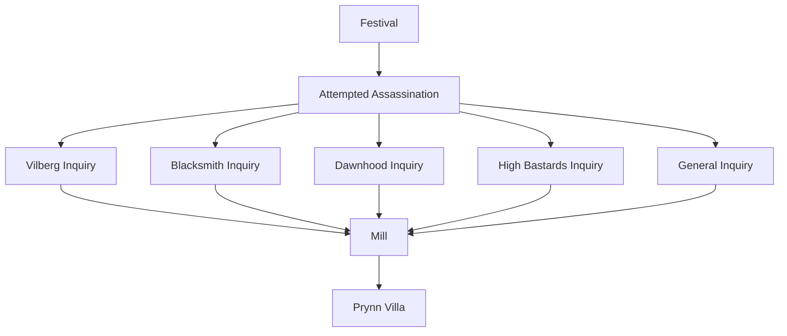

# Adventure Path: Cabarin's Corrupted

Hidden away in the royal ward of [[Shar Overview|Shar]] is a group known as Cabarin's Corrupted. Lead by [[Cabarin]], a nagpa who wishes to accelerate the calamity that is predicted to befall the world by the next new moon. He is aided by a Zehir assassin named [[Eveus]], and a host of nobles that [[Cabarin]] himself has schmoozed over.

## Introduction
The adventure starts with the party's triumphant return to Shar, upon which a festival is prepared. It takes only one day to fully prepare for the festival, after which it commences on the dusk of the following day.

### Festival of the March

The agenda for the festival is as follows:

***First Period.*** A venue of bards and entertainers performing to get the spirits up. Bookended by announcements made in thanks of sponsors and gratitude to the knights.

***Second Period.*** A banquet for the attendees with music and conversation from noble families.

***Third Period.*** A commemorative marching through Shar, culminating with the erection of statues made in honor of the Knights.

## Inciting Incident: Attempt on the Grand Duke's Life

On the night of the festival, [[Norman Mocsudom]] returns to his chambers in the royal villa, where he is accosted by [[Eveus]]. The guards were called and Eveus had launched her attack. Protected by a blessing granted to him long ago, Norman survived the encounter, though the blessing is now spent and his life is in danger, as Eveus had escaped.

In response, Norman Mocsudom heightens security measures and notifies the party of the events transpired, and asks for their aid in catching the assassin:

> "I apologize for the sudden summons, but I believe this to be of utmost importance. I wish to inform you of an even that had transpired on the night of the festival."
>
> "After celebrations, when I had withdrawn to my chambers here in the villa, it seemed there was an assassin awaiting my arrival. Luckily the guards had come to my aid in time, causing them to flee."
> 
> "I survived by happenstance, but this assassin still remains at-large. We suspect this is the work of the Theocracy. Which, if true, means they may be trying to make a move, and one so close to the heart of the Duchy is... unacceptable."
>
> "In regard to catching the assassin, they have left a clue of their identity: they wielded a dagger that was shaped like a serpent. Such a crude weapon would only be used by those that worship Zehir."
>
> "Please keep an eye out for this would-be assassin. If this is the Theocracy, then your lives may be in danger too. You are hereby dismissed."

## Discovering the Assassin

There are three avenues of discovering the assassin's identity:
- Asking people
	- Citizens if they have seen someone suspicious
	- Smiths in the area if they have seen a dagger
	- Worshippers of Zehir

## Prynn Estate
### Cellar Level
#### 1. Wine Cellar
The north wall is stocked with 100 bottles of House Prynn wine (20 gp ea., 2000 gp total), and the south wall has three alcoves that contain barrels of the same wine. Each alcove has three stacked barrels. A single barrel of wine weighs 150 lbs and can be sold for 1000 gp.

***Secret Door.*** The central alcove has a false wall behind the barrels, which is discernable with a DC 15 Wisdom (Perception) check.

#### 2. Guarded Hall
This hall is watched by two trained bowmen who stand behind arrow slits in area 4, providing them with 3/4 cover. They will fire at any unfamiliar creatures. One round after the bowmen fire, the thugs will enter the hall through a secret door.

Any noise made in this area attracts the attention of the creatures in areas 4 and 3.

***Secret Door.*** The flush wall can actually pivot, acting as a door. It requires a DC 20 Wisdom (Perception) check to notice the seam in the wall.

#### 3. Cabarin's Quarters
This ruinous bedchamber is occupied by the head guard of the Prynn estate. He is drafting a letter of resignation, which can be found on the dilapitated desk.

#### 4. Guard Station
The door to this chamber is barred from the inside. The chamber has 8 bunked beds and a host of weaponry and armor, all bearing the heraldry of House Prynn.

#### 5. Cross Hall
The walls of this hall are moist, and the air is dank. The chamber is dominated by a 20-foot-deep central atrium that is halfway filled with pristine water. The sound of rushing water can be heard coming from the northern exit.

#### 6. Trapped Sewer Entrance
The hall connects to the sewer system of Shar, and has a ladder that leads to a fake well just outside the walls of the Prynn estate. Rainwater trickles down the ladder into the sewer track.

***Trapped Bridge.*** There is a glyph of warding placed on the walkway to the ladder. It is nearly invisible, but can be noticed with a DC 20 Intelligence (Investigation) check. A creature that steps on it triggers the glyph and must make a DC 20 Wisdom saving throw or be polymorphed into The Lost for 1 minute or until their new form is reduced to 0 hit points.

#### 7. Cabarin's Court
This small chamber is filled with benches that look towards a raised, 5-foot-high platform. Standing on the platform is Cabarin and the head of house Prynn. To the side of Cabarin is a lever, and behind him against the western wall is a large replica of Shar. 

The pillars provide Cabarin half-cover. As soon as the characters enter, Cabarin pulls the lever, which drops the portcullis in front of the door.

***Adamantine Portcullis.*** A 5-foot section of the portcullis has 23 AC and 27 hit points, and can be bent with a DC 26 Strength (Athletics) check.

#### 8. Trapped Vault
This 10-foot-high hallway opens up into the Prynn family vault, containing some of their more valuable heirlooms. The entrance is trapped with a pressure plate, discernable with a DC 20 Wisdom (Perception) check. When a creature steps on the pressure plate, nothing immediately happens. After 1 minute has passed, Initiative should be rolled as the ground in the hallway begins to rise towards the ceiling, blocking the entrance completely. On initiative count 20, and again on 10, the floor rises 2 feet.

***Statue.*** The glass statue depicts Tiamat, the goddess of wealth, greed, and vengeance. It is enchanted with a protective dweomer that prevents teleportation into and out of this area. If attacked, the statue animates into a glass hydra with resistance to piercing and slashing damage.

### Ground Floor
#### 1. Garden
This beautiful garden is maintained by a halfling druid and his inseperable mastiff companion. He only attacks trespassers after giving them ample warning. Excessive noise in this area will alert the patrol in area 6.

#### 2. Servant's Quarters Vestibule
A large, ornate rug is laid out on the floor and the hall is a silver chandelier.There is also a very strong smell of cooking spices coming from the northernmost hall.  The sound of footsteps can be heard to the east, down the stairs. 

#### 3. Cellar Stairs
These creaky cellar stairs lead to the wine cellar.

#### 4. Kitchen & Pantry
This room smells heavily of garlic, onion, and other spices. Against the southern wall is an arrangement of silver-plated cutlery, ornate pewter chalices, and embroidered tablecloths. The northern wall has a large stovetop set into the wall, and a set of cooking utensils. The most notable object is a silver meat tenderizer. Against the eastern wall is a large cupboard filled with cooking spices and ingredients.

***Treasure.*** Everything in the kitchen is in great condition and very expensive:
- A creature can gather the cooking implements to obtain up to three sets of cook's utensils.
-  The set of silverware weighs 5 lbs. and can be sold for 750 gp — there are 8 chalices that can be sold for 100 gp each and there are 12 tablecloths that can be sold for 50 gp each.
-  The cupboard contains several ingredients, along with several other items of interest:
	- *Heward's Handy Spice Pouch*
	- *Leech Dust*
	-  A wine bottle that contains a potion of superior healing
	-  Exotic herbs and spices

#### 5. Dining Room
Several padded chairs surround a large wooden table. There is a gold-plated candelabra with 3 lit *Candles of Everburning*. The western wall has an awakened, animated, mounted bear head that greets any characters when they enter. The bear head knows of Cabarin and that the Prynn family is being used, and asks them to put an end to the nagpa.

#### 6. Main Hall
Three guards patrol this hall. They will attempt to get reinforcements from area 8.

***Treasure.*** One of the guards has a large keyring with several iron keys. This contains the keys to all doors on the ground floor.

#### 7. Lounge
There are two chaise longue chairs set in front of a fireplace, with a table between them. On the table is an ornate snuff box filled with 4 doses of a earthy green paste called Patch. When consumed orally, it instills the creature with a euphoria that causes disadvantage on Wisdom saving throws for the next 2 (1d4) hours. For the duration, the creature can speak with plants and animals.

#### 8. Guard House Gallery
The vestibule here has many detailed portraits of members of House Prynn, including Eveus. It is decorated with several marble busts. The sound of people talking can be heard from area 8A.

***Treasure.*** Guards carry their personal affections, along with a coin pouch containing 28 (8d6) gold.

##### 8A. Barracks
This room acts as a sleeping quarters and lounge for the guards. It is currently occupied by the head wizard of the guard.

***Treasure.*** There are several bunked beds that don't look that comfortable. At the center of the room is a small table that the guards are playing cards on. The head wizard is an evoker who keeps his Spellbook on him at all times.

##### 8B. Makeshift Holding Quarters
This room was primarily used as a dressing room for the guards but has been converted into a holding cell for Sybil Prynn, the eldest daughter of the Prynn family.

#### 9. Guardhouse Vestibule
This room and its doors are alarmed against entry and leads to the armory in area 10.

#### 10. Armory
The armory has weapon and armor racks along the walls, each of the implements bear the insignia of House Prynn.

***Treasure.*** There are 20 serviceable sets of cudgels and leather armor.

### Upper Floor
#### 1. Servant Quarters
The servants of House Prynn have all had their Charisma score reduced to 1, and act as dummies with no personality who obey all commands given by members of House Prynn. A creature with passive History of 15 or more will realize one of the servant's real identity as Bree Fastfoot, the lead journalist for Shar's biggest broadsheet company who went missing some weeks ago.

***Treasure.*** The servants don't have any valuables. 

#### 2. Supply Closet
Shelves line the walls here, and there are many cleaning supplies and various tools. One notable object is a Jar containing lard with a label that reads, "Griffon Grease".

***Treasure.*** The griffon grease acts as *Oil of Slipperiness*.

#### 3. Bedroom
This is the master bedroom of the Prynn family. On the southeastern wall is a large canopied bed. The eastern wall has a huge hanging tapestry depicting an idyllic vineyard landscape. There is a large trunk and a wardrobe in the northwest corner.

***Treasure.*** The wardrobe contains 5 sets of regal dress worth 200 gp each. One of the sets is actually a set of *Clothes of Mending*. In the trunk is 780 (12d12 x 10) platinum pieces, and a *Longsword of Speed, +1*.

#### 4. Study
The walls of this chamber are lined with bookshelves, and there is a single round desk at the center of the room set with many drawers. The top of the desk has scuff marks that resemble bootprints.

***Secret Door.*** The bookshelf to the north is a secret door, operated by an invisible rope hanging from the ceiling above the desk. It requires a creature stand on the desk to pull. The draft coming from the north is noticeable with a DC 20 Wisdom (Perception) check.

***Treasure.*** There is one 4th-level spellbook in the bookshelves, and two scrolls in the desk's drawers. The scrolls are a *Spell Scroll of Seeming*, and a *Spell Scroll of Dispel Magic*.

#### 5. Bedroom
This bedroom is reserved for the daughters of House Prynn. Two separate beds are in this room, along with a lyre of exquisite quality. It is a *Cli Lyre*.

#### 6. Trophy Room
#### 7. Attic