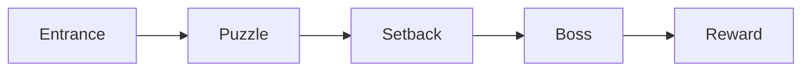
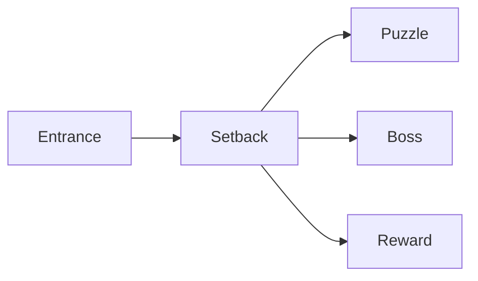
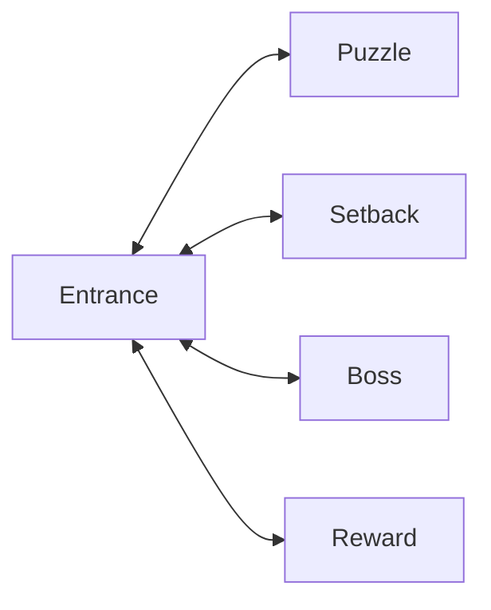
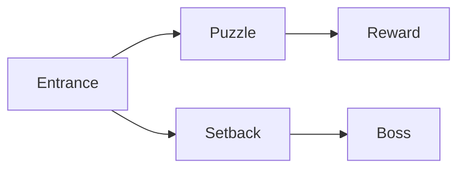
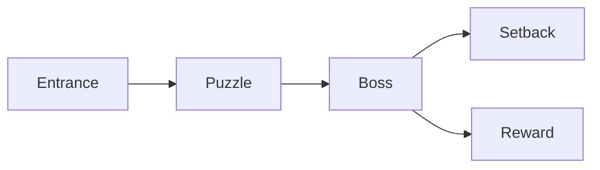
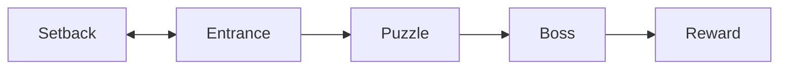

# Dungeon Design

Notes on designing a dungeon. 

## <u> The 5-Room Layout<u> [^1]

[^1]: [5-room-dungeon](https://nerdsonearth.com/2017/12/5-room-dungeon/)

1. Entrance/Guardian
2. Puzzle/Social Encounter
3. Trick/Setback
4. Boss Fight
5. Reward/Twist

## <u> The Checklist<u> [^2]

[^2]: [Dungeon checklist](https://goblinpunch.blogspot.com/2016/01/dungeon-checklist.html)

Things to include in a dungeon:
- [ ] Something to steal, plunder, or take
- [ ] Something to kill, fight, or defeat
- [ ] Something to kill, threaten, or endanger the characters
- [ ] Someone to talk to
- [ ] Something to interact or experiment with
- [ ] Secrets that can be missed
- [ ] Alternate paths or explorable options
	- Use network theory to extrapolate paths

## <u> Principles and Guidelines <u>

### Applicable Doom Guidelines [^3]

[^3]: [John Romero's Level Design Rules](https://youtu.be/ptHurafdCoQ)

- All visible spaces should be explorable
- Design multiple secrets per level
- Create landmarks or easily-recognizable features

### Dan Taylor's 10 [^4]

[^4]: [Ten Principles for Good Level Design](https://youtu.be/iNEe3KhMvXM)

1. Design for fun navigation
2. Show, don't tell (environmental storytelling)
3. Provide **what** must be done, not **how**
4. Teach the player the whole time
5. Utilize surprise and confusion; twists
6. Empower the player
7. Design paths of varying difficulty, with varying reward
8. Design efficiently, not superfluously
9. Evoke emotion
10. Provide mechanical grounding to reinforce character interaction

### The Dungeon Master's Guide [^5]

[^5]: [DMG, Page 99](https://5etools-mirror-1.github.io/book.html#dmg,5,dungeons,0)

- Asymmetry is dynamic
- Utilize 3D space (verticality)
- Give the dungeon some wear and tear
- Incorporate natural features
- Add multiple entrances and exits
- Add secret doors and rooms

### Addressing the Retraversal Problem [^6]

[^6]: [Backtracking and Level Design](https://youtu.be/-H97gCCJFXA)

- Design for advancement (no dead-ends)
	- Blow a hole through a wall
	- Have the paths reconverge
- Use verticality to change the horizontal direction
- Loop-around
- Use vehicles and mechanisms that trivialize retraversal
- Incorporate shortcuts and backdoors
	
### Appendix A: Sample 5-Room Dungeons

###### The Railroad

###### The Rooster

###### The Cross

###### The Mighty Duck

###### The Decision

###### The Wrong Way

