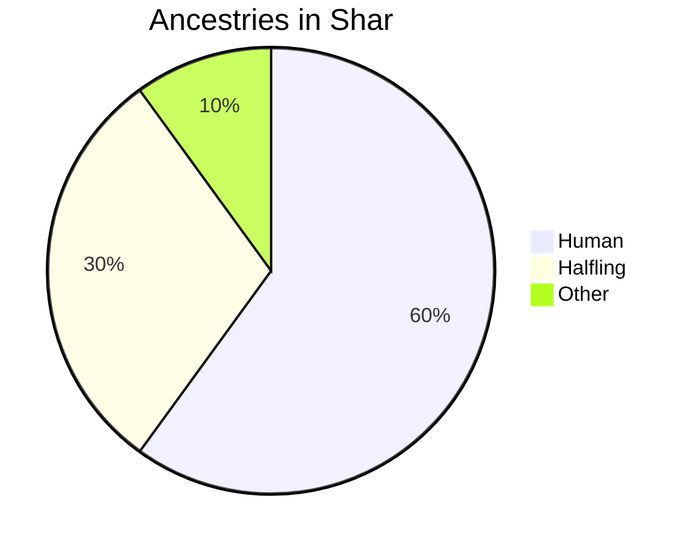

# Shar
> Shar, the ringed city — capital of the Great Duchy of Alrinh.

Shar is a city of humility. People with wealth don't often show it, and even the poorest can find accomodations here. Shops are less common than market stands. The city is ripe with symbols and good omens of Pelor, as almost everyone here is an avid worshipper of the deity. There is typically a relaxed nature, and people rarely make a scene.

## Major NPCs
NPC|Race|Occupation
-|-|-
[[Norman Mocsudom]]|Human (Male)|Grand duke
[[Godfrey Barnet]]|Human (Male)|Royal treasurer of magical finery
[[Fleeting Mirage on the Wind (Mirage)]]|Tabaxi (Male)|Portmaster
[[Mother Catalina]]|Human (Female)|Head priestess of Pelor; Dawnhood leader
[[Brutus Beorn]]|Half-orc (Male)|Captain of the Hematite Dreadnaughts
[[Paela & Laela Brushgather]]|Halfling (Female)|Twin leaders of the Veridaean council
[[Erik "Patch" Steiner]]|Human (Male)|Leader of the Questers Young
[[Bell]]|Kenku (Female)|Town crier and sower of rumours

---

A citizen's ancestry can be determined randomly by rolling a D20:

1d20|Ancestry
-|-
1|Exotic Race (Evil)
2-6|Halfling
7-19|Human
20|Exotic Race (Good)

---

## Nobility
4 prominent noble families exist, and each have their estate within the innermost ward of Shar.

***House Amakiir.*** Predating all other noble families, this elven house specializes in seafaring and naval exploits. They oversee many portside operations, ranging from coastal trade to naval warfare.

***House Fezim.*** The Fezim are a human family that captures and sells monsters. Monsters that can't be trained as pets or guard beasts are sold to arenas or harvested for their meat, bones, and skins. The Fezim sponsor adventuring parties and monster-hunting expeditions, and their motto is "What you fear, we master."

***House Lentamine.*** The Lentamine are a highly religious human house that oversee the funding of the Dawnhood and the other religious projects of Shar.

***House Prynn.*** The Prynn were once exiled from Shar for criminal activities, but have since returned. They are procurers of fine wine.

---

## Law

1. Crimes against Nobility
	- Life or career threatening crimes — death
	- Petty crimes against nobility — exile, flogging, imprisonment, fines
2. Crimes against the City
	- Destruction — death or hard labor with compensation
	- Knavery — imprisonment
	- Undercity involvement — exile
	- Treason — death
3. Crimes against the Gods
	- Assault — imprisonment and fines
	- Knavery — fines
	- Blasphemy — edict
	- Theft — imprisonment and compensation
4. Crimes against Citizens
	- Life or career threatening crimes — imprisonment, flogging, fines
	- Theft — long imprisonment and compensation
	- Destruction — compensation
	- Wanton murder — death or hard labor up to 10 years
	- Just murder — exile or hard labor up to 3 years
5. Crimes using Magic
	- Influencing without consent — harsh fines and edict
	- Scrying — exile

---

## Architecture
All buildings aside from those outside the city walls are constructed of stonemasonry. A number of aqueducts are used for city water supply, and many grates can be found that lead to the vast sewer system.

### City Layout
Shar gets its name — the ringed city — from its tiered walls. There are three districts, each separated by guarded battlements. The innermost ward is the royal ward, where aristocrats and noble families reside. The intermediary ward is the market ward, where most guilds and trade operate. Beyond that is the gantry, which isn't a ward in actuality, as it is outside Shar's walls. The gantry ward has farm plots, stables, and peasant residences.

Each ward has a few gated entrances that are located conveniently on the roads. The gates remain open until curfew or in times of a potential siege. Each ward has a gate to the docks, which are technically considered a part of the gantry ward, though sometimes they may be refered to as the dock ward.

City Ward|Population
-|-
Dock Ward|1,000 (Low)
Gantry Ward|10,000 (High)
Market Ward|1,000 (Low)
Royal Ward|5,000 (Medium)
Total|17,000

### Sights in Shar

###### Art Installations

***Tower of Pelor.*** A huge lighthouse in the dock ward with a golden star that casts light towards the sea at night.

***Knights of the March.*** A marble statue in the market ward commemorating the original Knights of the March, Gunther, Bardin, and Olivier.

***Fountains, Murals, Mosaics.*** Plenty of art installations exist in the innermost walls of Shar. Most of them depict religious symbology of Pelor, or halfling deities such as Arvoreen.

###### Buildings

***The Shipwreck.*** A portside tavern built to look like a large ship. Many seafaring adventurers spend time and coin here. If the building itself wasn't interesting enough, there's also an awakened pellican that entertains the patrons.

***The Great Mill.*** On the outskirts of Shar is an exceptionally large, riverside mill. It spans 4 stories and houses a couple dozens of workers. It doubles as a tavern/inn for peasantry.

***Gift House of Avandra.*** A huge, circular building in the market ward, made of marble with a peristyle dedicated to gambling, drugs, and prostitution. Holy symbols of Avandra are spread throughout.

***Merchant's Den.*** An arcaded bazaar that operates beneath the guild hall in the market ward.

***High Court of Theneta.*** A large alabaster courthouse in the royal ward where all criminal judgements take place. There are a host of noble judges but additionally, there is an annual judgement from a Sphinx known as Theneta that takes place for more sensitive cases.

###### Various Shops

Shop|Name|Owner(s)
-|-|-
Pawnshop|The Pauper's Gate|Goldfound Family (Halfling)
Herbs & Incense|Birchclaw's Breath|Ralf Wendel (Human)
Pottery|Potter's Place|Eva Sloan (Human)
Library|The Font of Erudition|Whispermouse Family (Halfling)
Blacksmith|Quil's Foundry|Oquiless "Quil" (Fire Genasi)
Weaver|Stitching Tooth|Nim Raethran

---

## Factions

###### Major Factions

***[[Dawnhood of Pelor|Dawnhood.]]*** Religious pacifists who offer healing to citizens and adventurers.

***[[Hematite Dreadnaughts|Hematite Dreadnaughts.]]*** Special task force focused on sensitive military operations.

***[[Questers Young|Questers Young.]]*** Adventurer's guild who promote bounty and monster hunting.

***[[Veridaean Council|Veridaean Council.]]*** Faction that tends to the city's parks and farms, while thwarting undead threats.

###### Minor Factions

***Lukas' Shunned.*** A wererat gang who live in the city's sewers.

***High Bastards of Alrinh.*** Starting out as an adventuring party, the bastards have evolved into a large crime syndicate who often employ racketeering tactics to make money.

***Unsleeping Thistles.*** A small group of vigilantes — enemies against criminals of all kind, while acting above the law.

---

## High Level Adventure Primers

***Greasing the Gears of War.*** The characters must rescue [[Jarthraxxinvarum]], the hundred-horned so that he may aid in the ongoing war between the Duchy and the Urogan.

***Sabotage.*** The Urogan are devising a weapon with the help of dwarven engineering. The characters must seek and destroy the weapon before it is completed.

***Monster Escape.*** A rampaging Goristro has escaped from the ruins of Kinsey and is hiding somewhere at the base of the unresting mountain. The characters must track the monster and kill or banish it.

***Celestial Assassination.*** [[Barithiel]], a fallen planetar and Urogan commander has taken hold of a fortress on the western edge of the great lake. The characters must infiltrate the fortress and deal with him.

***Fallen Hematite Scouts.*** A group of 9 hematite dreadnaughts were sent through the unresting mountain to scout out Urogan developments in Sazjuless. They have yet to report back. [[Mother Catalina]] has confirmed that they have died. The characters are to discover the circumstances of their death, and if possible destroy whatever killed them.

### Adventures in Shar

***Sewage Problem.*** The characters come upon a body of a Cellarers' Guild member in front of a sewage grate, covered in slime, with strange wounds — their eyes rolled back into their head and blood which has streamed from the nose and ears.

***Corrupt Cabal.*** See: [[Cabarin's Corrupted]]