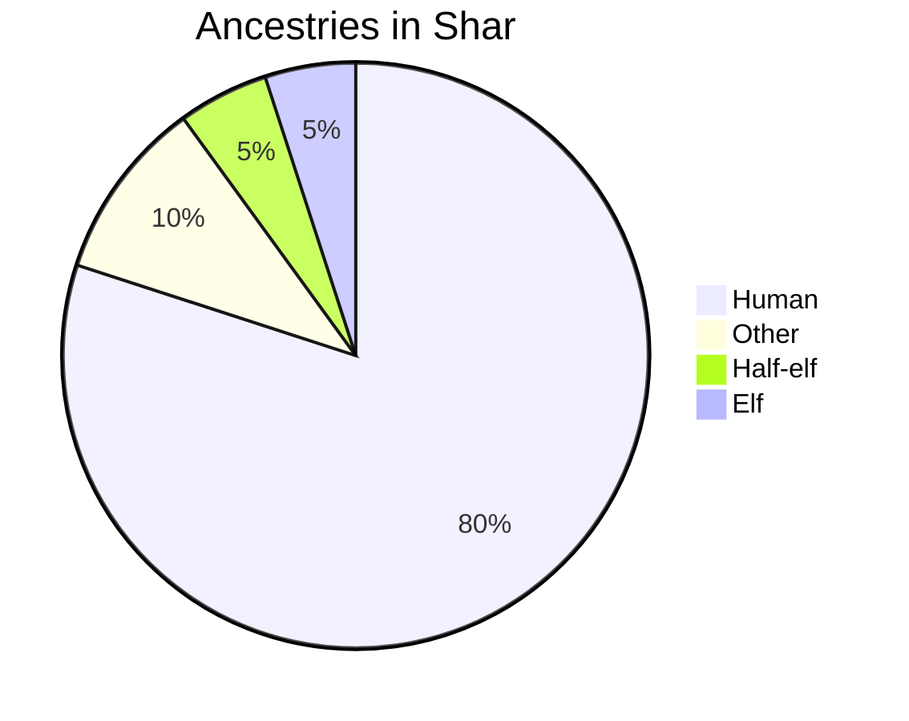

# Kinsey
> Kinsey, the archival city — home of the Great Alrinhian Academy.

Built upon the ruins of an ancient city, Kinsey is where scholars make their stay. It is a sprawling haven for academia, abounding with treatises, records, and scrolls. Most of its citizens get caught up in the aristocratic life of wizardry and the upper echelons of academia. As a result, they often lack the social sensibilities that would have been taught through experience.

## Major NPCs
NPC|Race|Occupation
-|-|-
[[Sage-Duchess Tomph]]|Half-orc (Female)|Duchess of Kinsey
[[Bei Renshu]]|Half-elf (Male; Blessed of Corellon)|Lead artificer of the [[Annals of the Dead City]]
[[Antonius Illvult]]|Tiefling of Glasya (Male)|Leader of the [[Eyes of Kinsey]]; Master of memories
[[Claudia Rellencia]]|Half-elf (Female)|Head priestess of Ioun
[[Viktor Rellencia]]|Human (Male)|Captain of the guard; brother of [[Claudia Rellencia]]
[[Octavia Nerracus]]|Human (Female)|Headmaster of the [[Great Alrinhian Academy]]

---

---

## Nobility
3 prominent noble families exist, and each have a respective court in the [[Great Alrinhian Academy]]. They are known as the solemn chambers of Kinsey.

***Chamber Rellencia.*** Predating all other noble families, this human house procures spells and arcane implements for the purposes of war. They rose to their height of prominence during Alrinh's defense from the raids of Nevania. Now, the conflicts between the Duchy and the Urogan may spark new purpose in the Rellencias. They are solely in charge of the prison

***Chamber Kellimeus.***  

---

## Law

1. Crimes against Nobility
	- Life or career threatening crimes — death
	- Petty crimes against nobility — exile, flogging, imprisonment, fines
2. Crimes against the City
	- Destruction — death or hard labor with compensation
	- Knavery — imprisonment
	- Undercity involvement — exile
	- Treason — death
3. Crimes against the Gods
	- Assault — imprisonment and fines
	- Knavery — fines
	- Blasphemy — edict
	- Theft — imprisonment and compensation
4. Crimes against Citizens
	- Life or career threatening crimes — imprisonment, flogging, fines
	- Theft — long imprisonment and compensation
	- Destruction — compensation
	- Wanton murder — death or hard labor up to 10 years
	- Just murder — exile or hard labor up to 3 years
5. Crimes using Magic
	- Influencing without consent — harsh fines and edict
	- Scrying — exile

---

## Architecture

### Sights in Kinsey

###### Art Installations

###### Buildings

###### Places of Interest

---

## Factions

###### Major Factions

###### Minor Factions

---

## High Level Adventure Primers

